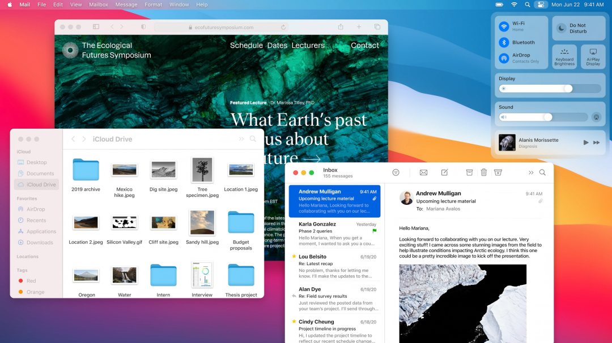

Big Sur 对整个交互界面进行了重新设计，有用更丰富和平滑的动效设计，更统一的设计风格，更现代的呈现方式。

如你所见，现在 Dock 栏的图标几乎都变成了我们熟悉的圆角矩形（除了最右边的最近文件和废纸篓）。Big Sur 还带来了全新统一的识别符号，在需要的时候会自动显现，这一切是不是都让你想起了 iPadOS？

苹果还在 Big Sur 引入了新的控制中心，非常类似 iPadOS，用户可以在这里控制亮度，选择 Wi-Fi，就像使用 iPhone 或者 iPad 一样。而通知功能也被进一步加强，小工具变得更好看，更丰富。

要说最近两年 macOS 最大的变革，可能就是苹果一直在致力于让 iOS 的应用和 macOS 融合化，比如前年为 macOS 带来了股票、新闻和语音备忘录，去年则将音乐、播客、电视、屏幕时间和捷径等数个原本只能在 iOS 端上使用的应用搬了上了来。

去年苹果还宣布了 Project Catalyst 计划，意图将 iOS 和 iPadOS 上应用能够轻松移植到 macOS 上，也算是在为转向 ARM 铺平道路。目前在 App Store 已经有了一批基于此技术开发移植的应用。

全新版本的地图应用也得到了增强，同样也基于 Project Catalyst 技术。

Safari 浏览器也变得更快，隐私保护更好，苹果表示要比 Google 的 Chrome 快上 50%，能效比也要强上 50%，还支持了更多的 WebExtensions API 扩展功能。

现在 Safari 浏览器支持了更多的自定义设置，比如更换起始页的壁纸，现在你可以把它变得花里胡哨的。

从目前来看，iOS 包括 iPadOS 正在和 macOS 逐渐融合，桌面端原有的操作习惯和逻辑已经慢慢化为养料哺育了 iPadOS，比如今天 iPadOS 14 中看到的侧边工具栏，类似 Spotlight 的搜索框。而移动端更现代的设计也反过来改造了 macOS 的整体设计。

tvOS 14：支持游戏手柄。

